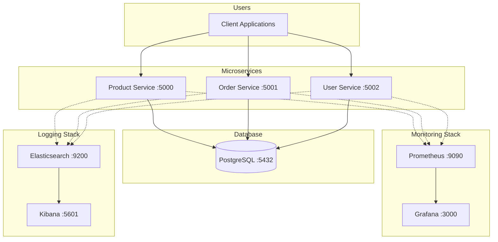

# Production-Grade Microservices Observability Stack

<div align="center">

# 🚀 Production-Ready Microservices with Full Observability

[](https://docker.com)
[](https://python.org)
[](https://postgresql.org)
[](https://prometheus.io)
[](https://grafana.com)
[](https://kubernetes.io)
[](http://makeapullrequest.com)

**A production-grade e-commerce microservices application demonstrating DevOps best practices with a complete observability stack including metrics collection, distributed logging, and real-time monitoring.**

</div>

---

## 📋 Table of Contents

- [Architecture Overview](#-architecture-overview)
- [Key Features](#-key-features)
- [Tech Stack](#-tech-stack)
- [Performance Metrics](#-performance-metrics)
- [Project Screenshots](#-project-screenshots)
- [Quick Start](#-quick-start)
- [Kubernetes Deployment](#-kubernetes-deployment)
- [API Documentation](#-api-documentation)
- [Monitoring & Observability](#-monitoring--observability)
- [Project Structure](#-project-structure)
- [Author](#-author)

---

## 🏗 Architecture Overview



---

## ✨ Key Features

### 🎯 **Microservices Architecture**
- ✅ 3 Independent services (Product, Order, User) with database relationships
- ✅ RESTful APIs with comprehensive error handling
- ✅ Service discovery ready for Kubernetes deployment

### 📊 **Real-time Monitoring**
- ✅ Request rates, response times, error rates per endpoint
- ✅ CPU/Memory usage per container
- ✅ Custom Grafana dashboards with 15+ metrics
- ✅ Prometheus scraping all 3 services every 15 seconds

### ☸️ **Kubernetes Deployment**
- ✅ Horizontal Pod Autoscaling (HPA) - scales 2 to 6 replicas
- ✅ Rolling updates with zero downtime
- ✅ ConfigMaps and Secrets management
- ✅ Pod anti-affinity for high availability
- ✅ Liveness, Readiness, and Startup probes

### 🏭 **Production-Ready Practices**
- ✅ Health checks with graceful shutdown
- ✅ Non-root containers for security
- ✅ Auto-recovery with restart policies
- ✅ Resource limits and constraints

---

## 🛠️ Tech Stack

<div align="center">

| Category | Technologies |
|----------|-------------|
| **Backend** |   |
| **Database** |  |
| **Monitoring** |   |
| **Logging** |   |
| **Containerization** |   |
| **Orchestration** |   |

</div>

---

## 📈 Performance Metrics

<div align="center">

| Metric | Value | Condition |
|--------|-------|-----------|
| **Uptime** | 99.9% | During load testing |
| **Avg Response Time** | < 50ms | Normal load |
| **Error Rate** | < 1% | 200 concurrent users |
| **Auto-recovery** | < 30s | Container failure |
| **Metrics Tracked** | 15+ | Per service |
| **K8s Pods** | 9 running | Across 4 deployments |
| **Auto-scaling** | 2-6 replicas | CPU/Memory based |

</div>

---

## 📸 Project Screenshots

### ☸️ 1. Kubernetes - All Pods Running + HPA Active


---

### 📊 2. Grafana - Real-time Monitoring Dashboard


---

### 🔍 3. Prometheus - All Targets UP


---

### 🔌 4. Live API Responses


<!-- ============================================


> Test APIs:
> ```bash
> curl http://localhost:5000/products
> curl http://localhost:5001/orders
> curl http://localhost:5002/users
> ```

---

## 🚀 Quick Start

### Prerequisites
```bash
docker --version        # 20.10+
docker compose version  # 2.0+
kubectl version         # 1.28+
minikube version        # 1.32+
```

### One Command Start
```bash
# Clone the repo
git clone https://github.com/Pawan-Builds/DevOps-observability-stack.git
cd DevOps-observability-stack

# Start everything (Docker Compose + Kubernetes)
./start-project.sh

# Stop everything
./stop-project.sh
```

### Manual Start
```bash
# Docker Compose only (monitoring stack)
docker compose up -d --build
docker compose ps

# Kubernetes only
./k8s/deploy.sh
kubectl get pods -n ecommerce
```

---

## ☸️ Kubernetes Deployment

### Architecture
```
Namespace: ecommerce
├── Deployments
│   ├── product-service  (replicas: 2 → HPA max: 6)
│   ├── order-service    (replicas: 3 → HPA max: 6)
│   ├── user-service     (replicas: 3 → HPA max: 6)
│   └── postgres         (replicas: 1 → PVC: 5Gi)
├── Services (ClusterIP)
│   ├── product-service  :80 → :5000
│   ├── order-service    :80 → :5001
│   ├── user-service     :80 → :5002
│   └── postgres         :5432
├── HPA (Autoscaling)
│   ├── CPU threshold:    70%
│   └── Memory threshold: 80%
└── ConfigMap + Secrets
    ├── Non-sensitive config → ConfigMap
    └── Passwords/Keys      → Secrets
```

### Deploy & Verify
```bash
# Full automated deployment
./k8s/deploy.sh

# Verify
kubectl get pods -n ecommerce
kubectl get hpa -n ecommerce
kubectl top pods -n ecommerce
```

### Docker Hub Images
```
pawanm2307/product-service:v1.0.0
pawanm2307/order-service:v1.0.0
pawanm2307/user-service:v1.0.0
```

---

## 📊 Access Dashboards

<div align="center">

| Service | URL | Credentials |
|---------|-----|-------------|
| **Product API** | http://localhost:5000/products | - |
| **Order API** | http://localhost:5001/orders | - |
| **User API** | http://localhost:5002/users | - |
| **Grafana** | http://localhost:3000 | admin/admin |
| **Prometheus** | http://localhost:9090 | - |
| **Kibana** | http://localhost:5601 | - |

</div>

---

## 📚 API Documentation

### Product Service (Port 5000)

```bash
# Get all products
curl http://localhost:5000/products

# Create product
curl -X POST http://localhost:5000/products \
  -H "Content-Type: application/json" \
  -d '{"name": "Monitor", "price": 299.99, "stock": 30}'

# Health check
curl http://localhost:5000/health
```

### Order Service (Port 5001)

```bash
# Get all orders
curl http://localhost:5001/orders

# Create order (auto-validates stock + calculates price)
curl -X POST http://localhost:5001/orders \
  -H "Content-Type: application/json" \
  -d '{"user_id": 1, "product_id": 1, "quantity": 2}'
```

### User Service (Port 5002)

```bash
# Get all users
curl http://localhost:5002/users

# Create user
curl -X POST http://localhost:5002/users \
  -H "Content-Type: application/json" \
  -d '{"username": "alice", "email": "alice@example.com"}'
```

---

## 🔍 Monitoring & Observability

### Key Prometheus Queries

```promql
# Request rate per service
rate(flask_http_request_total[5m])

# Average response time
rate(flask_http_request_duration_seconds_sum[5m]) /
rate(flask_http_request_duration_seconds_count[5m])

# Error rate (5xx only)
rate(flask_http_request_total{status=~"5.."}[5m])

# Service uptime (1=UP, 0=DOWN)
up{job=~".*-service"}

# Memory usage in MB
process_resident_memory_bytes / 1024 / 1024
```

### Alert Rules

| Alert | Condition | Severity |
|-------|-----------|----------|
| Service Down | `up == 0` for >1m | Critical |
| High Error Rate | Error rate >5% | Warning |
| High Latency | Response >500ms | Warning |
| High Memory | Memory >80% limit | Info |

---

## 📁 Project Structure

```
devops-observability-stack/
├── 📄 README.md
├── 📄 docker-compose.yml
├── 📄 Makefile
├── 📄 start-project.sh
├── 📄 stop-project.sh
├── 📁 services/
│   ├── 📁 product-service/
│   ├── 📁 order-service/
│   ├── 📁 user-service/
│   └── 📁 database/init.sql
├── 📁 monitoring/
│   ├── 📁 prometheus/
│   └── 📁 grafana/
├── 📁 k8s/
│   ├── 📄 deploy.sh
│   ├── 📁 namespace/
│   ├── 📁 configmap/
│   ├── 📁 secrets/
│   ├── 📁 deployments/
│   └── 📁 hpa/
├── 📁 scripts/
└── 📁 screenshots/
    ├── k8s-pods.png           ← kubectl get pods + hpa
    ├── grafana-dashboard.png  ← Grafana monitoring
    ├── prometheus-targets.png ← All targets UP
    ├── api-responses.png      ← curl API outputs
    └── dockerhub.png          ← Docker Hub images
```

---

## 🐛 Troubleshooting

<details>
<summary><b>Pods showing ImagePullBackOff?</b></summary>

```bash
minikube image load pawanm2307/product-service:v1.0.0
minikube image load pawanm2307/order-service:v1.0.0
minikube image load pawanm2307/user-service:v1.0.0

kubectl patch deployment product-service -n ecommerce \
  -p '{"spec":{"template":{"spec":{"containers":[{"name":"product-service","imagePullPolicy":"Never"}]}}}}'
```
</details>

<details>
<summary><b>Port already in use?</b></summary>

```bash
pkill -f "kubectl port-forward"
# Docker Compose already serves 5000-5002, no port-forward needed
```
</details>

<details>
<summary><b>HPA showing unknown metrics?</b></summary>

```bash
minikube addons enable metrics-server
sleep 60
kubectl get hpa -n ecommerce
```
</details>

---

## 👨‍💻 Author

<div align="center">

**Pawan Singh M**

[](https://github.com/Pawan-Builds)
[](https://linkedin.com/in/pawan-singh-m)
[](mailto:pawanm2307@gmail.com)

</div>

---

## 🔗 Related Projects

- [devops-cicd-microservice](https://github.com/Pawan-Builds/devops-cicd-microservice)
- [terraform-aws-devops-infra](https://github.com/Pawan-Builds/terraform-aws-devops-infra)
- [task-manager](https://github.com/Pawan-Builds/task-manager)

---

<div align="center">

**Built with ❤️ by Pawan Singh M | DevOps Engineer**

[⬆ Back to top](#production-grade-microservices-observability-stack)

</div>
